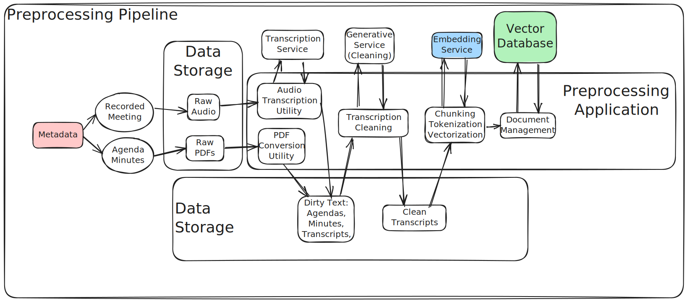

# 🚀 Preprocessing Pipeline for Meeting Transcriptions and Documents

    

## 🌟 Overview

The **Preprocessing Pipeline** is a staff-facing application designed to streamline the transcription, cleanup, and vectorization of meeting-related documents such as agendas, minutes, and audio files. This tool enables municipal staff to:

- Upload 🖼️, process ⚙️, and view 👀 transformed documents at each stage.
- Ensure accurate and efficient management of meeting data 🏛️.
- Integrate metadata 📋 for organizational clarity.
- Use cutting-edge AI tools 🤖 to enhance transcription quality and create vector embeddings for further analysis.

---

## ✨ Features

### 🏠 Home Page
- **Upload Documents**: A page to upload files and provide metadata.
- **View Documents**: A page to view and download files at different processing stages.

### 📤 Upload Documents
- Upload agendas, minutes, or audio files.
- The system processes the files through transcription, cleaning, and vectorization stages.

#### For Audio Files 🎙️:
- Choose between AssemblyAI models for transcription:
  - **Nano**: Faster, cheaper, lower quality.
  - **Best**: Higher quality, slower, more expensive.
- Files up to **1GB** can be uploaded.

#### For Agendas and Minutes 📄:
- Upload PDFs for processing.
- Converts text or uses OCR for scanned documents.

### 📂 View Documents
- Access and download files at these stages:
  - **Raw Audio** 🎵
  - **Dirty Transcriptions** 📝
  - **Clean Text** ✅

---

## ⚙️ How to Start

1. Go to the [Streamlit Preprocessing App](https://minutematestaff.streamlit.app/).

2. Configure your API keys in the sidebar:

   - **OpenAI**  
     - [Get your OpenAI API Key](https://platform.openai.com/api-keys)  
     - Set `OPENAI_API_KEY` in the sidebar.  
     - For `OPENAI_BASE_URL`, use `https://api.openai.com/v1` or leave it blank.
   - **Weaviate**  
     - [Access your Weaviate Cluster details](https://console.weaviate.cloud/cluster-details)  
     - Follow [this guide](https://weaviate.io/developers/wcs/create-instance) to create a new cluster if needed.  
     - Set `WEAVIATE_URL` with the REST endpoint and `WEAVIATE_API_KEY` with the admin key.
   - **AssemblyAI**  
     - [Create an AssemblyAI account](https://www.assemblyai.com/app)  
     - Copy your API key from the homepage and set it in `ASSEMBLY_AI_KEY`.
   - **Azure**  
     - [Create a storage account](https://learn.microsoft.com/en-us/azure/storage/common/storage-account-create?tabs=azure-portal)  
     - Go to the Access Keys section in Azure and copy the connection string into `AZURE_STORAGE_CONNECTION_STRING`.  
     - Specify the container name in `AZURE_STORAGE_CONTAINER_NAME`.

3. Use the **Upload Documents** page to:
   - Add metadata:
     - **📅 Meeting Date**: Any date.
     - **🏛️ Meeting Type**: Board of Commissioners or Planning Board.
     - **📄 File Type**: Agenda, Minutes, or Audio.
   - Upload files for processing.

4. Monitor the preprocessing stages in the **View Documents** page, where you can access Raw, Dirty, and Clean documents.

---
